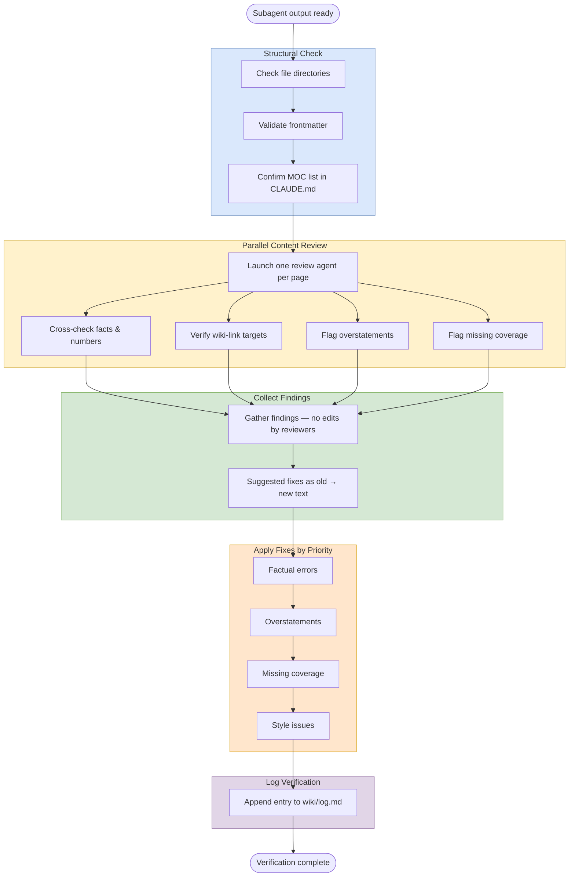

# Verification

## Purpose
Quality-assurance pass for work done by parallel subagents. Use it to catch structural mistakes, factual drift, and missing coverage before fixes are merged into shared files.

## When To Use
- After batch ingests.
- After batch MOC creation.
- After batch expansions.
- After any other parallel subagent workflow that creates or edits pages in isolation.

## Trigger Phrases
- `verify the subagents`
- `run verification`
- `quality check the batch output`
- `review the parallel work`

## Do Not Use When
- No parallel subagents were involved.
- You only need a quick single-file sanity check.
- You are still deciding what to create or edit.
- The task is purely structural planning with no page output yet.

## Required Context
- The list of created or edited files.
- The workflow that produced them.
- The source pages or reference files each output depends on.
- Any shared files that must not be edited by subagents.

## Procedure
1. Treat subagent output as suspect until checked. Subagents work in isolation and commonly make mistakes such as wrong file paths, imprecise claims, numbers off by small amounts, or conflated findings from different papers.
2. Run the **structural check** directly as the coordinator:
   - Confirm files are in the correct directories, such as `wiki/` rather than the vault root, and the correct `sources/` subdirectory when relevant.
   - Confirm frontmatter is complete and consistent with existing pages, including `title:` and the correct `type:`.
   - Confirm `CLAUDE.md`'s Current MOCs list matches the actual `wiki/mocs/*.md` files.
3. Run the **content accuracy check** in parallel, one review subagent per created page:
   - Each review agent reads the created page and every source page it references.
   - Cross-check author names, venues, years, specific numbers, and method descriptions.
   - Verify `[[wiki-links]]` targets exist and match the described content.
   - Flag overstatements, including editorial synthesis presented as direct findings, cherry-picked peak numbers without context, or conflated findings from different papers.
   - Flag missing coverage, including relevant pages that should have been included but were not.
   - Return findings only, with suggested fixes written as exact `old -> new` text where possible.
4. Collect review findings only; do not let review agents make edits.
5. Apply fixes in priority order: factual errors, overstatements, missing coverage, then style.
6. Log the verification pass in `wiki/log.md`.

## Completion Checklist
- Structural checks are clean.
- Review agents have read the created pages and their source references.
- All reported errors have been prioritized and fixed.
- `wiki/log.md` has a verification entry.

## Related Workflows
- `workflows/batch-ingest.md`
- `workflows/moc-gap-analysis.md`
- `workflows/enrich.md`
- `workflows/expand.md`
- `workflows/synthesize.md`
